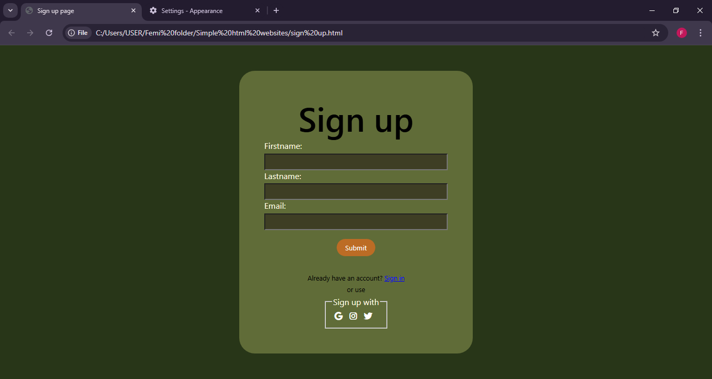
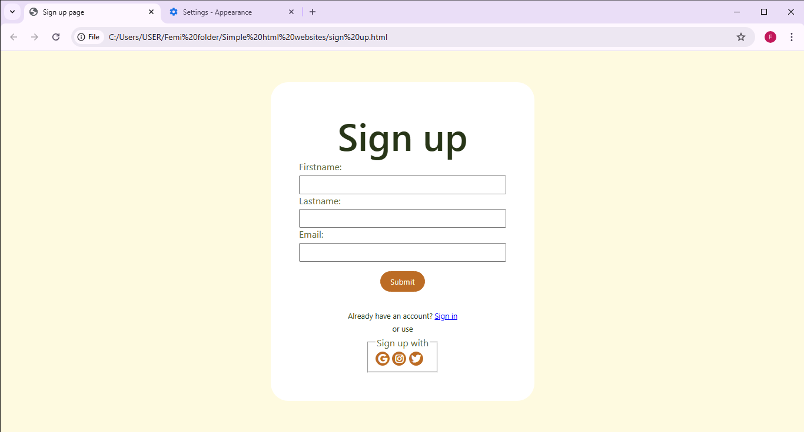

# 🎉 Sign Up Page Mini Project

## 📌 Overview
This project is a responsive and accessible sign-up page built with a strong focus on usability and user experience. It includes theme support and interactive elements to enhance engagement.

---

## ✨ Features

### ♿ Accessibility
- Fully navigable using keyboard only
- Designed to support users with disabilities

### 🔍 Focus Visibility
- Clear focus indicators to show which element is currently selected

### 🌗 Light & Dark Mode
- Users can switch between light and dark themes
- Interface adapts based on the selected mode

### 📱 Responsive Design
- Layout adjusts smoothly across different screen sizes
- Maintains structure and readability when zoomed

### 🎨 Interactivity
- Button hover effects (color changes on hover)
- Alert displayed when the submit button is clicked

### 🔗 Icons Integration
- Uses Font Awesome icons for:
  - Google
  - Instagram
  - Twitter

---

## 🛠️ Technologies Used
- HTML  
- CSS  
- Font Awesome  

---

## 🚀 How to Run the Project

1. Extract the `font awesome.zip` file into the same folder as `sign up.html`
2. Open the `sign up.html` file in your browser

---

## 🖼️ Screenshots

---

## 📝 Notes
- Ensure all files are in the same directory for icons to display properly
- This project demonstrates accessibility and responsiveness best practices

---

## 💡 Future Improvements (Optional)
- Add form validation
- Connect to a backend service
- Improve animations and transitions

---

⭐ Feel free to fork, improve, and share!
